# Deep Ensembles Replication


A PyTorch replication of *Simple and Scalable Predictive Uncertainty Estimation using Deep Ensembles* (Lakshminarayanan, Pritzel, Blundell, 2017), with a focus on classification performance, predictive uncertainty, and calibration.


## Overview


This project aims to replicate key ideas from the Deep Ensembles paper in a clean, portfolio-friendly way. The initial focus is on a manageable classification setting using MNIST, comparing a single neural network against a deep ensemble of independently trained networks.


The broader goal is to understand how deep ensembles improve uncertainty estimation and calibration while remaining simple to implement and scale.


## Paper


**Reference**  

Balaji Lakshminarayanan, Alexander Pritzel, and Charles Blundell.  
*Simple and Scalable Predictive Uncertainty Estimation using Deep Ensembles.*  
NeurIPS 2017.


## Replication Goal


The first replication target is:


> Does a 5-member deep ensemble improve classification performance and calibration on MNIST relative to a single neural network?


This project is designed as a step-by-step replication rather than an attempt to reproduce the full paper in one pass.


## Scope


### Initial scope

- Train a single baseline classifier on MNIST
- Train an ensemble of 5 independently initialized classifiers
- Compare single-model vs ensemble performance
- Evaluate uncertainty-aware metrics
- Generate calibration plots


### Metrics

- Accuracy
- Negative Log-Likelihood (NLL)
- Brier Score
- Expected Calibration Error
- Reliability Diagram


### Later extensions completed

- Calibration gap summaries from reliability bins
- Improved reliability diagrams with bin counts
- Prediction confidence histograms
- Simple distribution-shift evaluation using noisy MNIST


## Repository Structure


```text

deep-ensembles-replication/

├── README.md
├── requirements.txt
├── pytest.ini
├── configs/
│   └── mnist.yaml
├── src/
│   ├── __init__.py
│   ├── data.py
│   ├── model.py
│   ├── train.py
│   ├── evaluate.py
│   ├── ensemble.py
│   ├── mc_dropout.py
│   ├── metrics.py
│   └── plotting.py
├── scripts/
│   ├── __init__.py
│   ├── train_single.py
│   ├── evaluate_mnist.py
│   ├── train_ensemble.py
│   ├── evaluate_ensemble.py
│   ├── compare_results.py
│   ├── save_comparison_artifacts.py
│   ├── save_confidence_histograms.py
│   ├── evaluate_shifted_mnist.py
│   ├── compare_shifted_results.py
│   ├── save_calibration_artifacts.py
│   ├── train_mc_dropout.py
│   ├── evaluate_mc_dropout.py
│   ├── evaluate_shifted_mc_dropout.py
│   ├── compare_mc_dropout_shifted_results.py
│   └── compare_all_methods.py
├── tests/
│   ├── test_data.py
│   ├── test_ensemble.py
│   ├── test_evaluate.py
│   ├── test_mc_dropout.py
│   ├── test_mc_dropout_eval.py
│   ├── test_metrics.py
│   ├── test_model.py
│   ├── test_plotting.py
│   └── test_train.py
├── checkpoints/
│   ├── mnist_baseline.pt
│   ├── mc_dropout.pt
│   └── ensemble/
│       ├── member_0.pt
│       ├── member_1.pt
│       ├── member_2.pt
│       ├── member_3.pt
│       └── member_4.pt
├── results/
│   ├── figures/
│   │   └── generated/
│   └── tables/
│       └── generated/
└── report/
    └── replication_report.md

```


## Environment Setup


### 1. Clone the repository


```bash

git clone https://github.com/NuMetriq/deep-ensembles-replication.git

cd deep-ensembles replication

```


### 2. Create and activate a virtual environment


#### Windows (PowerShell)

```bash

python -m venv .venv

.venv\Scripts\Activate.ps1

```


#### macOS / Linux

```bash

python -m venv .venv

source .venv/bin/activate

```


### 3. Install dependencies


```bash

pip install -r requirements.txt

```


## How to Reproduce the Results


### Train the baseline model


```bash
python -m scripts.train_single
```


### Evaluate the baseline model


```bash
python -m scripts.evaluate_mnist
```


### Train the deep ensemble


```bash
python -m scripts/train_ensemble
```


### Evaluate the deep ensemble


```bash
python -m scripts.evaluate_ensemble
```


### Generate baseline vs ensemble comparison artifacts


```bash
python -m scripts.compare_results
python -m scripts.save_comparison_artifacts
```


### Save confidence histograms


```bash
python -m scripts.save_confidence_histograms
```


### Evaluate on shifted MNIST


```bash
python -m scripts.evaluate_shifted_mnist
python -m scripts.compare_shifted_results
```


### Save calibration-focused artifacts


```bash
python -m scripts.save_calibration_artifacts
```


### Train the MC Dropout model


```bash
python -m scripts.train_mc_dropout
```


### Evaluate MC Dropout on clean MNIST


```bash
python -m scripts.evaluate_mc_dropout
```


### Evaluate MC Dropout on shifted MNIST


```bash
python -m scripts.evaluate_shifted_mc_dropout
python -m scripts.compare_mc_dropout_shifted_results
```


### Generate three-way comparison artifacts


```bash
python -m scripts.compare_all_methods
```


## Results


### Experiment
For the `v0.2.0` milestone, I trained:

- **Baseline:** 1 MNIST classifier
- **Ensemble:** 5 independently initialized MNIST classifiers, with predictions combined by averaging class probabilities

### Evaluation Metrics
The main evaluation metrics were:

- Accuracy
- Negative Log-Likelihood (NLL)
- Brier Score
- Reliability Diagram

### Summary Table

| Metric | Baseline | Ensemble | Delta (Ensemble - Baseline) |
|---|---:|---:|---:|
| Accuracy | 0.990200 | 0.992400 | +0.002200 |
| NLL | 0.033565 | 0.020762 | -0.012803 |
| Brier | 0.016628 | 0.010863 | -0.005765 |

### Calibration Plots

#### Baseline Reliability Diagram
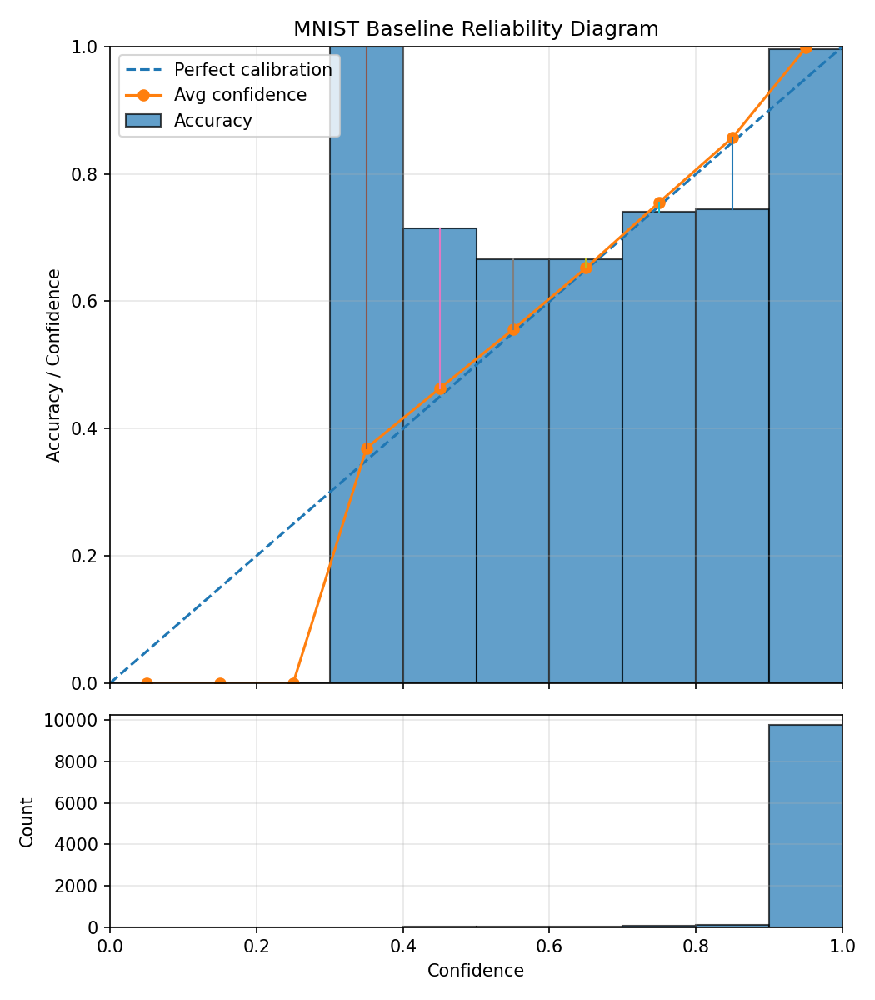

#### Ensemble Reliability Diagram
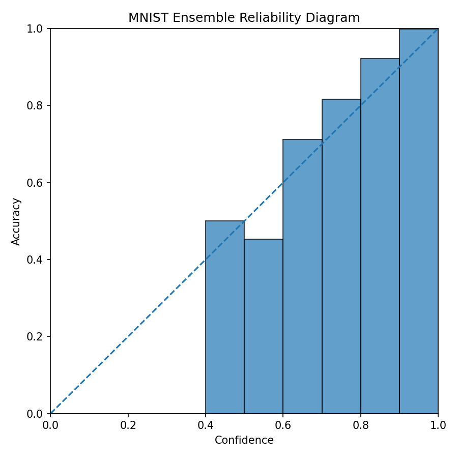

### Comparison Figure
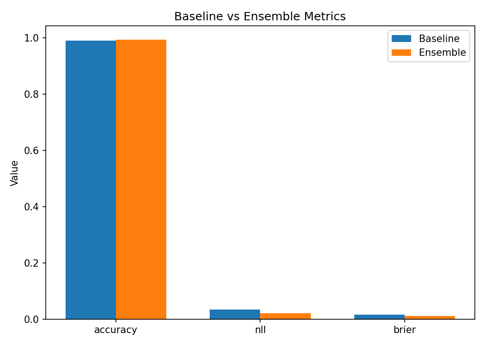

### Interpretation

On clean MNIST, the deep ensemble improved on the single-model baseline across the main metrics. Accuracy increased slightly, while NLL and Brier score both improved more noticeably. This is consistent with the paper’s central claim that deep ensembles improve not only point predictions, but also the quality of probabilistic predictions.


### Calibration and Uncertainty Analysis

#### Added in `v0.3.0`

This milestone extends the replication with a more detailed calibration and uncertainty analysis.

New additions include:

- Expected Calibration Error (ECE)
- calibration gap summaries from reliability bins
- improved reliability diagrams with bin counts
- prediction confidence histograms
- evaluation under a simple distribution shift using noisy MNIST

#### Calibration Metrics

In addition to accuracy, NLL, and Brier score, this version reports:

- **ECE**: Expected Calibration Error
- reliability-bin gap summaries for calibration analysis

#### Clean Data Comparison

| Metric | Baseline | Ensemble | Delta (Ensemble - Baseline) |
|---|---:|---:|---:|
| Accuracy | 0.990200 | 0.992400 | +0.002200 |
| NLL | 0.033565 | 0.020762 | -0.012803 |
| Brier | 0.016628 | 0.010863 | -0.005765 |

On clean MNIST, the deep ensemble outperformed the single-model baseline across all reported metrics. Accuracy improved from 0.990200 to 0.992400, while NLL decreased from 0.033565 to 0.020762 and Brier score decreased from 0.016628 to 0.010863. Expected Calibration Error (ECE) also improved slightly, falling from 0.003731 to 0.003200. Overall, these results suggest that the ensemble produced not only slightly better classifications, but also better calibrated and more reliable probability estimates.

#### Shifted Data Comparison

| Model | Condition | Accuracy | NLL | Brier | ECE |
|---|---|---:|---:|---:|---:|
| Baseline | Clean | 0.990200 | 0.033565 | 0.016628 | 0.003731 |
| Baseline | Shifted | 0.979900 | 0.061837 | 0.029985 | 0.002583 |
| Ensemble | Clean | 0.992400 | 0.020762 | 0.010863 | 0.003200 |
| Ensemble | Shifted | 0.991200 | 0.034548 | 0.015209 | 0.012882 |

Under the noisy shifted-input condition, the ensemble remained stronger than the baseline on accuracy, NLL, and Brier score. The baseline dropped to 0.979900 accuracy, while the ensemble remained at 0.991200. The ensemble also retained lower NLL (0.034548 vs. 0.061837) and lower Brier score (0.015209 vs. 0.029985), suggesting better overall predictive performance and probability quality under shift.

However, the ECE result is more mixed. The baseline's shifted ECE was 0.002583, while the ensemble's shifted ECE increased to 0.012882. So in this experiment, the ensemble was clearly stronger on accuracy, NLL, and Brier score under shift, but not uniformly better on ECE. This is a useful reminder that calibration behavior can depend on both the metric and the shift condition, and that stronger uncertainty-aware performance does not always imply improvement on every calibration summary.

Taken together, the shifted-data result is favorable to deep ensembles on most metrics, but not completely one-sided. The ensemble degraded more gracefully on accuracy, NLL, and Brier score, yet its ECE under this particular noisy condition was worse than the baseline's. That makes the replication more interesting: the ensemble appears more robust overall, but calibration under shift is not captured perfectly by a single metric.

These results suggest that deep ensembles improved overall predictive quality and robustness in this replication, while calibration under shift remained more nuanced and metric-dependent.


### Reliability Diagrams

#### Clean MNIST Baseline


#### Clean MNIST Ensemble


#### Shifted MNIST Baseline
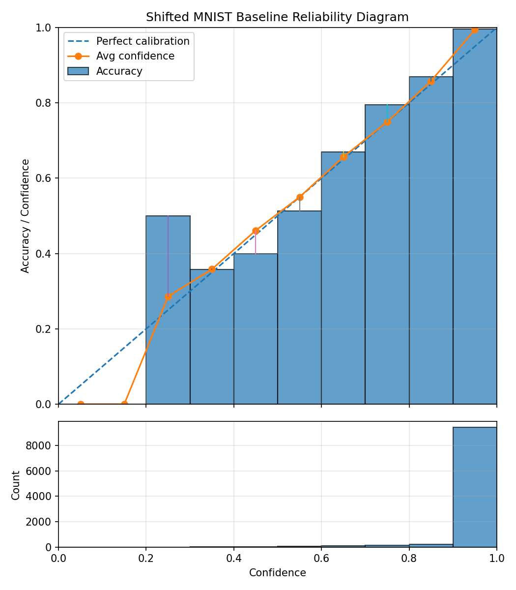

#### Shifted MNIST Ensemble
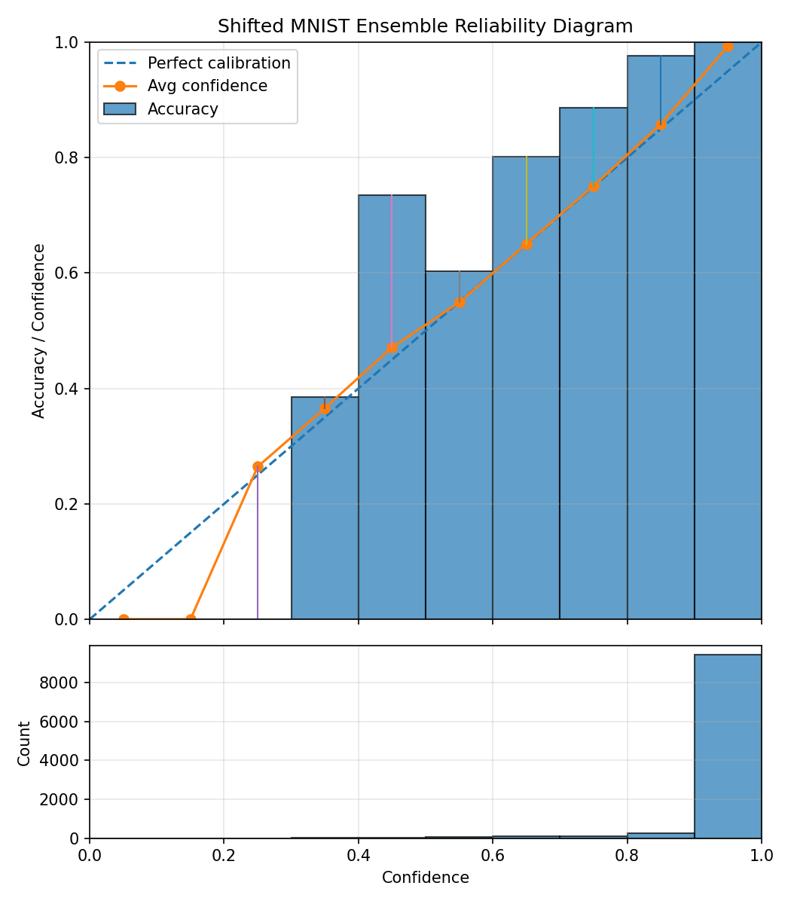

### Confidence Histograms

#### Clean Confidence Comparison
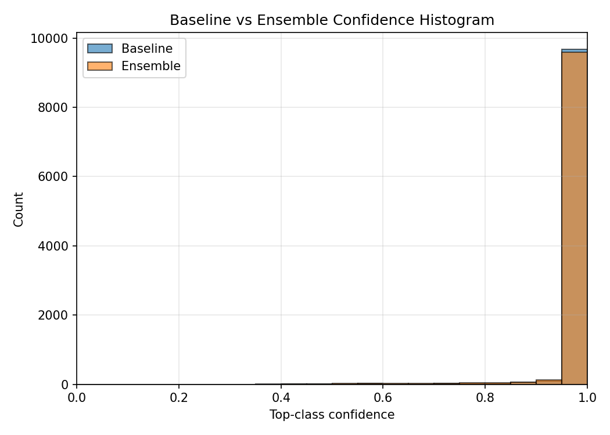

#### Shifted Baseline Confidence Histogram


#### Shifted Ensemble Confidence Histogram
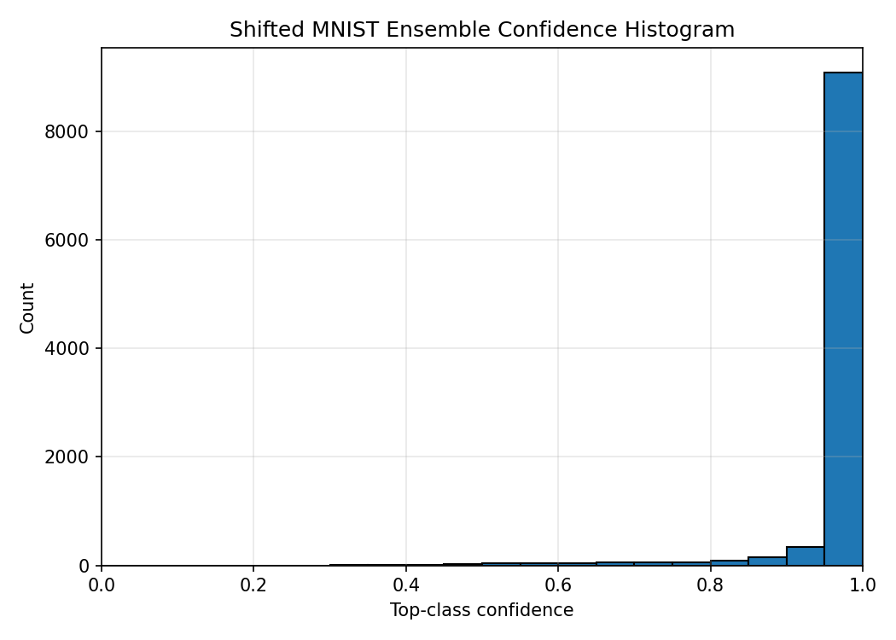

### ECE Comparison
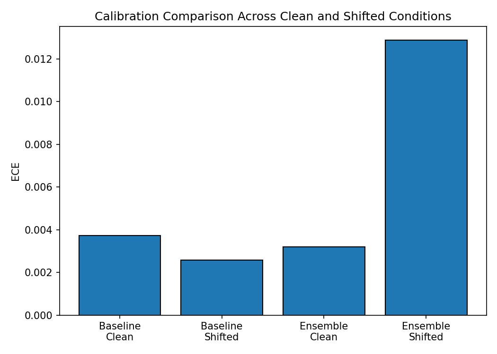


## Deep Ensembles vs MC Dropout

### Added in `v0.4.0`
This milestone extends the project by adding **MC Dropout** as a third uncertainty-estimation method alongside the single-model baseline and deep ensembles.

The comparison now includes three methods:

- **Baseline:** single deterministic CNN
- **Deep Ensemble:** 5 independently trained CNNs with probability averaging
- **MC Dropout:** dropout-enabled CNN with stochastic test-time inference

### Evaluation Setup
All three methods were evaluated on:

- **Clean MNIST**
- **Shifted MNIST** with Gaussian noise added to test inputs

The reported metrics are:

- Accuracy
- Negative Log-Likelihood (NLL)
- Brier Score
- Expected Calibration Error (ECE)

### Clean Data Comparison

| Method | Accuracy | NLL | Brier | ECE |
|---|---:|---:|---:|---:|
| Baseline | 0.990200 | 0.033565 | 0.016628 | 0.003731 |
| Ensemble | 0.992400 | 0.020762 | 0.010863 | 0.003200 |
| MC Dropout | 0.989800 | 0.036127 | 0.016950 | 0.008012 |

### Shifted Data Comparison

| Method | Accuracy | NLL | Brier | ECE |
|---|---:|---:|---:|---:|
| Baseline | 0.979900 | 0.061837 | 0.029985 | 0.002583 |
| Ensemble | 0.991200 | 0.034548 | 0.015209 | 0.012882 |
| MC Dropout | 0.983700 | 0.070010 | 0.029330 | 0.026868 |

### Comparison Figures

#### Clean MNIST ECE
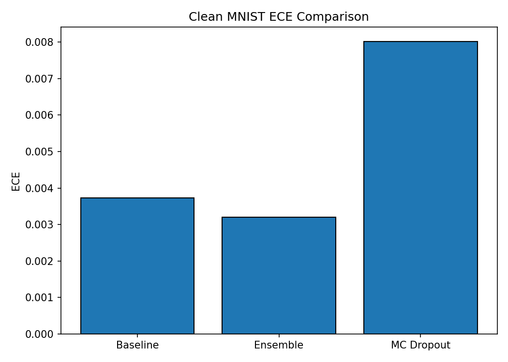

#### Shifted MNIST ECE
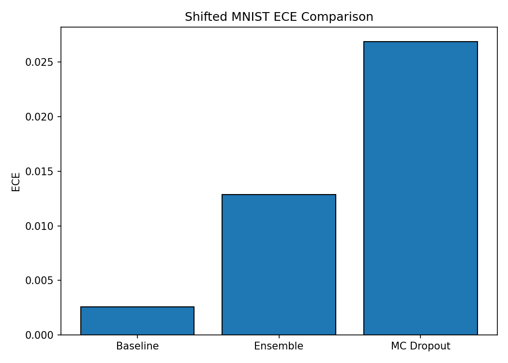

#### Clean MNIST NLL
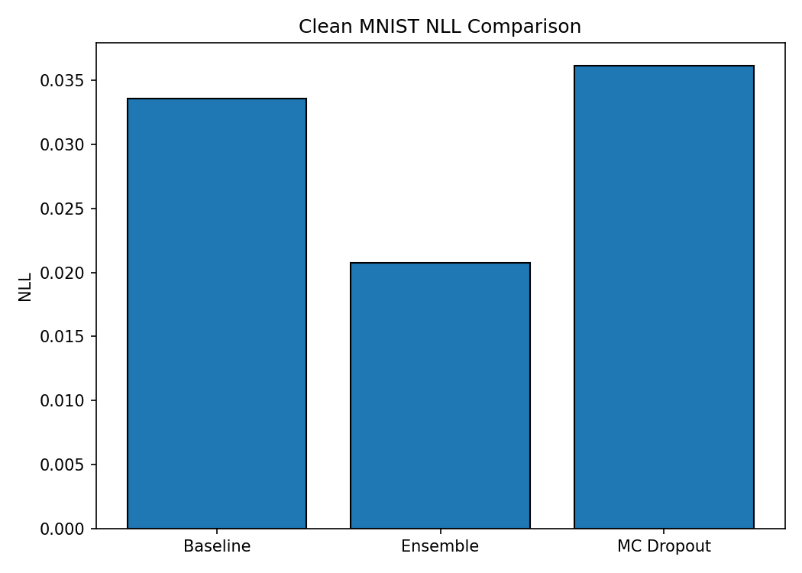

#### Shifted MNIST NLL
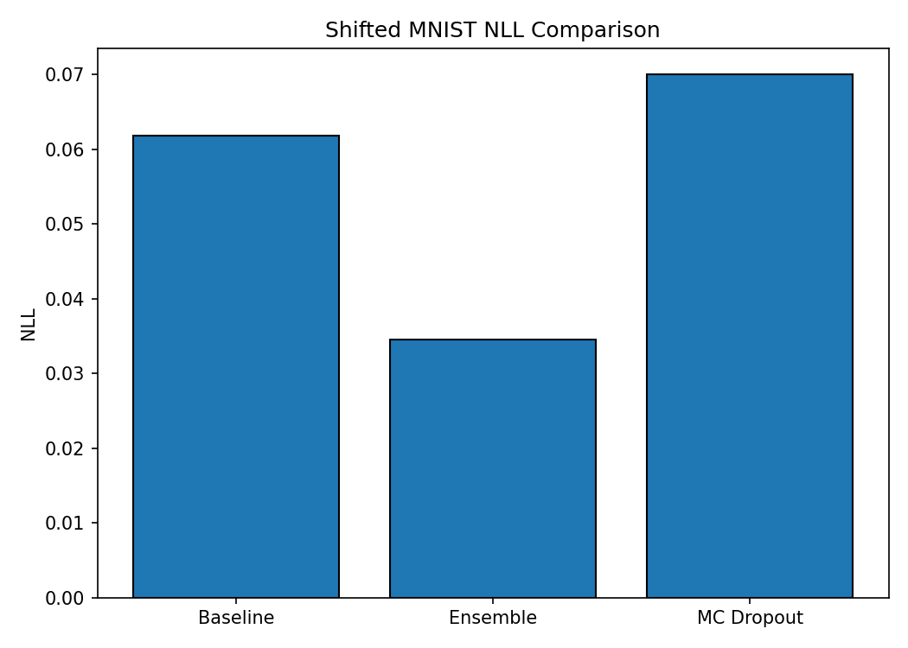

### Additional Method-Specific Figures

#### MC Dropout Reliability Diagram
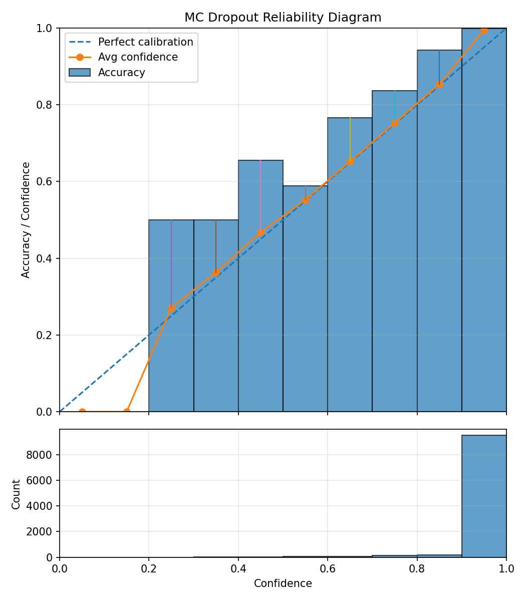

#### Shifted MC Dropout Reliability Diagram
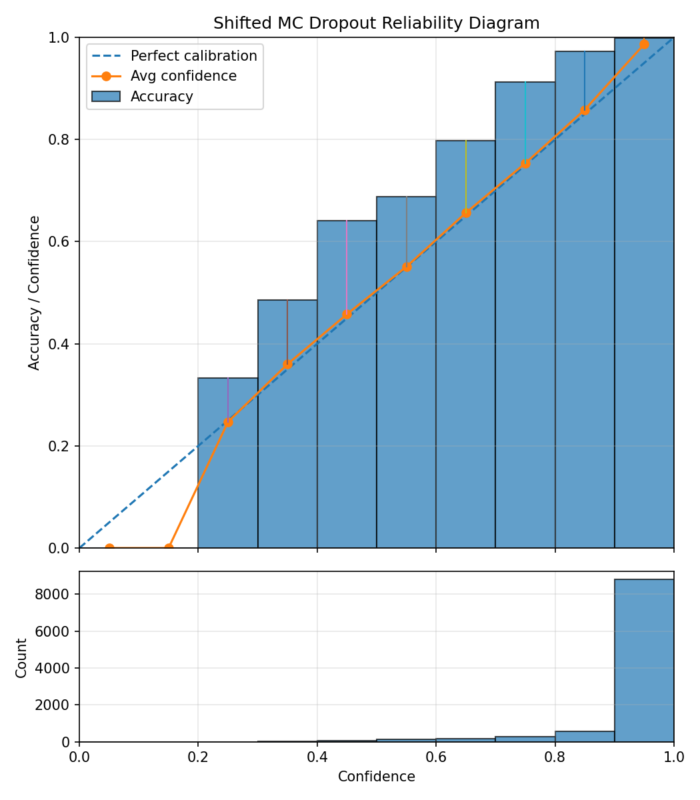

#### MC Dropout Confidence Histogram
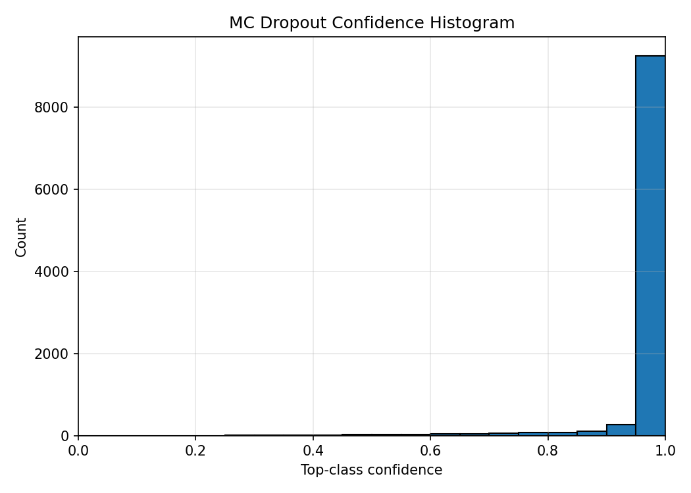

#### Shifted MC Dropout Confidence Histogram
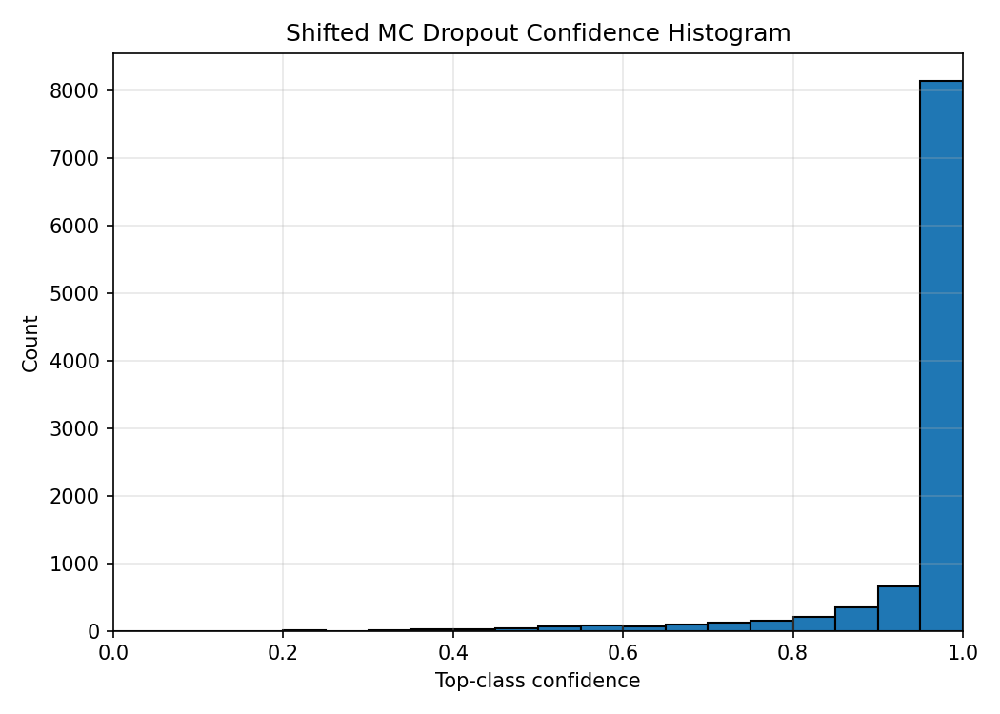

### Interpretation

Adding MC Dropout makes the project a more meaningful uncertainty-estimation comparison. Instead of comparing deep ensembles only against a single deterministic baseline, the repository now compares two different uncertainty-aware approaches under the same training and evaluation setup.

The key questions for this milestone are:

- Does MC Dropout improve uncertainty-aware metrics relative to the single-model baseline?
- Does MC Dropout remain competitive with deep ensembles on clean data?
- Under shifted data, which method degrades more gracefully?
- Are differences between methods more visible in NLL and ECE than in raw accuracy?

In many practical settings, deep ensembles are expected to perform strongly on predictive quality and uncertainty-aware scoring, while MC Dropout offers a cheaper approximate Bayesian alternative. This comparison helps show whether that pattern also appears in this replication.

### Practical Takeaway

This milestone strengthens the project by moving from:

- **baseline vs ensemble**

to:

- **baseline vs ensemble vs MC Dropout**


## Key Outputs

Running the full pipeline produces:

### Tables

- `results/tables/generated/baseline_metrics.json`
- `results/tables/generated/ensemble_metrics.json`
- `results/tables/generated/mc_dropout_metrics.json`
- `results/tables/generated/shifted_baseline_metrics.json`
- `results/tables/generated/shifted_ensemble_metrics.json`
- `results/tables/generated/shifted_mc_dropout_metrics.json`
- `results/tables/generated/baseline_vs_ensemble.json`
- `results/tables/generated/baseline_vs_ensemble.csv`
- `results/tables/generated/calibration_comparison_clean.csv`
- `results/tables/generated/calibration_comparison_clean.md`
- `results/tables/generated/calibration_comparison_shift.csv`
- `results/tables/generated/calibration_comparison_shift.md`
- `results/tables/generated/three_way_comparison_clean.csv`
- `results/tables/generated/three_way_comparison_clean.md`
- `results/tables/generated/three_way_comparison_shifted.csv`
- `results/tables/generated/three_way_comparison_shifted.md`

### Figures

- `results/figures/generated/baseline_reliability_diagram.png`
- `results/figures/generated/ensemble_reliability_diagram.png`
- `results/figures/generated/mc_dropout_reliability_diagram.png`
- `results/figures/generated/shifted_baseline_reliability_diagram.png`
- `results/figures/generated/shifted_ensemble_reliability_diagram.png`
- `results/figures/generated/shifted_mc_dropout_reliability_diagram.png`
- `results/figures/generated/baseline_vs_ensemble_metrics.png`
- `results/figures/generated/baseline_confidence_histogram.png`
- `results/figures/generated/ensemble_confidence_histogram.png`
- `results/figures/generated/mc_dropout_confidence_histogram.png`
- `results/figures/generated/baseline_vs_ensemble_confidence_histogram.png`
- `results/figures/generated/shifted_baseline_confidence_histogram.png`
- `results/figures/generated/shifted_ensemble_confidence_histogram.png`
- `results/figures/generated/shifted_mc_dropout_confidence_histogram.png`
- `results/figures/generated/ece_clean_vs_shifted.png`
- `results/figures/generated/three_way_ece_clean.png`
- `results/figures/generated/three_way_ece_shifted.png`
- `results/figures/generated/three_way_nll_clean.png`
- `results/figures/generated/three_way_nll_shifted.png`

### Checkpoints

- `checkpoints/mnist_baseline.pt`
- `checkpoints/mc_dropout.pt`
- `checkpoints/ensemble/member_0.pt`
- `checkpoints/ensemble/member_1.pt`
- `checkpoints/ensemble/member_2.pt`
- `checkpoints/ensemble/member_3.pt`
- `checkpoints/ensemble/member_4.pt`


## Current Status

### Completed Milestones

#### Milestone: v0.1.0 - Baseline Replication Setup

- ✅ Create GitHub repository
- ✅ Create local project structure
- ✅ Add `.gitignore`
- ✅ Add initial README
- ✅ Set up environment and dependencies
- ✅ Implement MNIST data pipeline
- ✅ Implement baseline classifier
- ✅ Implement evaluation metrics
- ✅ Implement reliability diagram
- ✅ Add runnable training and evaluation scripts


#### Milestone: v0.2.0 - Deep Ensemble Replication

- ✅ Implement ensemble checkpoint saving/loading
- ✅ Implement ensemble prediction via probability averaging
- ✅ Train 5 independent ensemble members
- ✅ Evaluate ensemble performance
- ✅ Compare baseline vs ensemble results
- ✅ Save comparison artifacts
- ✅ Document results in the README


#### v0.3.0 - Extended Uncertainty Analysis

- ✅ Implement Expected Calibration Error (ECE)
- ✅ Add calibration gap summaries
- ✅ Improve reliability diagram visualization
- ✅ Add confidence histogram visualization
- ✅ Evaluate uncertainty under simple distribution shift
- ✅ Save calibration-focused comparison artifacts
- ✅ Update README with calibration analysis


#### v0.4.0 - Deep Ensembles vs MC Dropout

- ✅ Implement dropout-enabled MNIST classifier
- ✅ Add training script for MC Dropout model
- ✅ Implement stochastic inference for MC Dropout
- ✅ Evaluate MC Dropout on clean MNIST
- ✅ Evaluate MC Dropout under shifted MNIST
- ✅ Add three-way comparison across baseline, ensemble, and MC Dropout
- ✅ Update README with three-way comparison


### Next Milestones


#### Possible future directions

- adversarial training
- out-of-distribution evaluation beyond noisy MNIST
- additional datasets beyond MNIST
- broader replication of experiments from the original paper


## Replication Philosophy


This repository is intended to be:

- faithful to the central ideas of the paper
- incremental and well-documented
- reproducible
- suitable for a GitHub portfolio


The emphasis is on understanding and communicating the method clearly, not just matching every reported number exactly.


## Notes


This is an education replication project intended to deepen understanding of uncertainty estimation in deep learning and to demonstrate practical machine learning engineering on GitHub.


## License


To be added.


---

